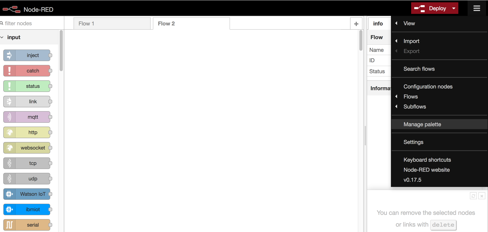
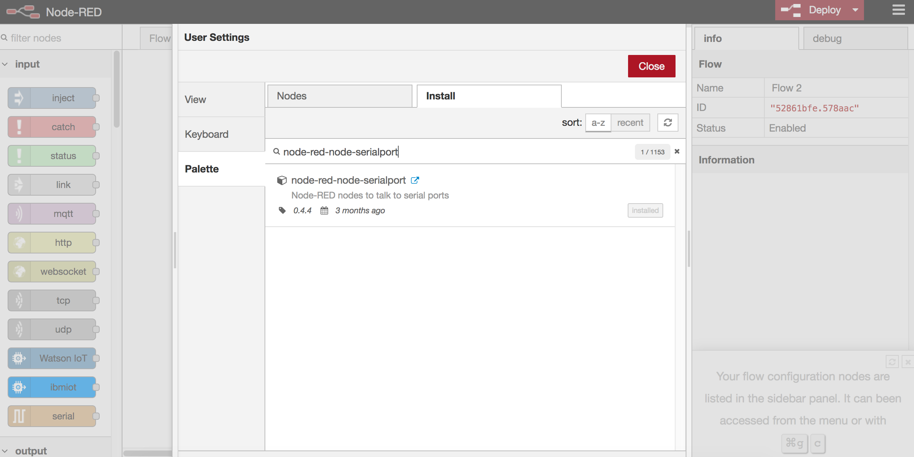
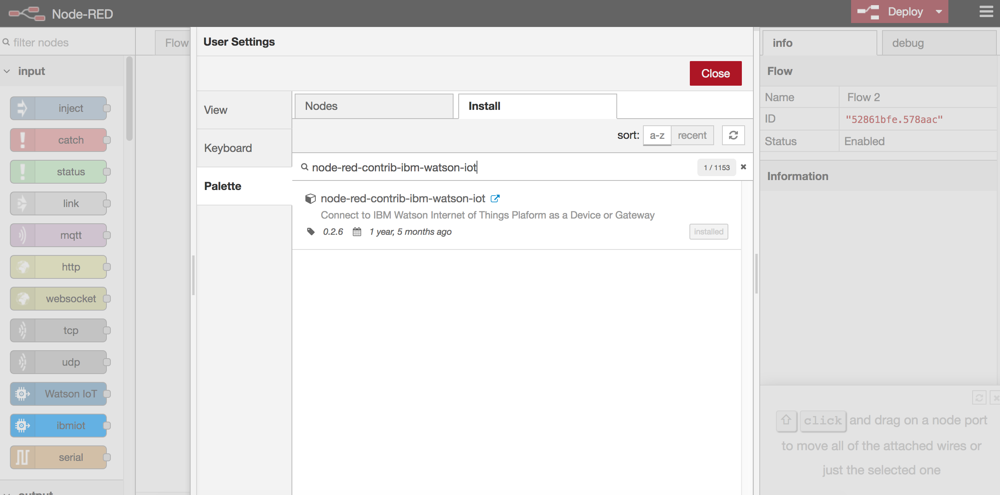

# Node-RED Flow #   
This section shows how the connected Arduino device is made an IoT device by sending the events to Watson IoT Platform.  
1. In case Node-RED is not installed on the development system, install Node-RED by following the instructions given in the guide https://nodered.org/docs/getting-started/installation    
2. Add serial port node by following the instructions given in npmjs.com https://www.npmjs.com/package/node-red-node-serialport or by using the palette, in the Node-RED as shown below.    

 
3. Add watson iot device by following the instructions given in npmjs.com https://www.npmjs.com/package/node-red-contrib-ibm-watson-iot or by using the palette, in the Node-RED as shown below.    

    
4. Import  by executing the command `node-red -v -f arduino_quickstart.json`  
5. Modify the device id in the watson-iot-device node by providing a unique id.   
6. Go to Quickstart dashboard and observe the events reaching the Quickstart dashboard.
