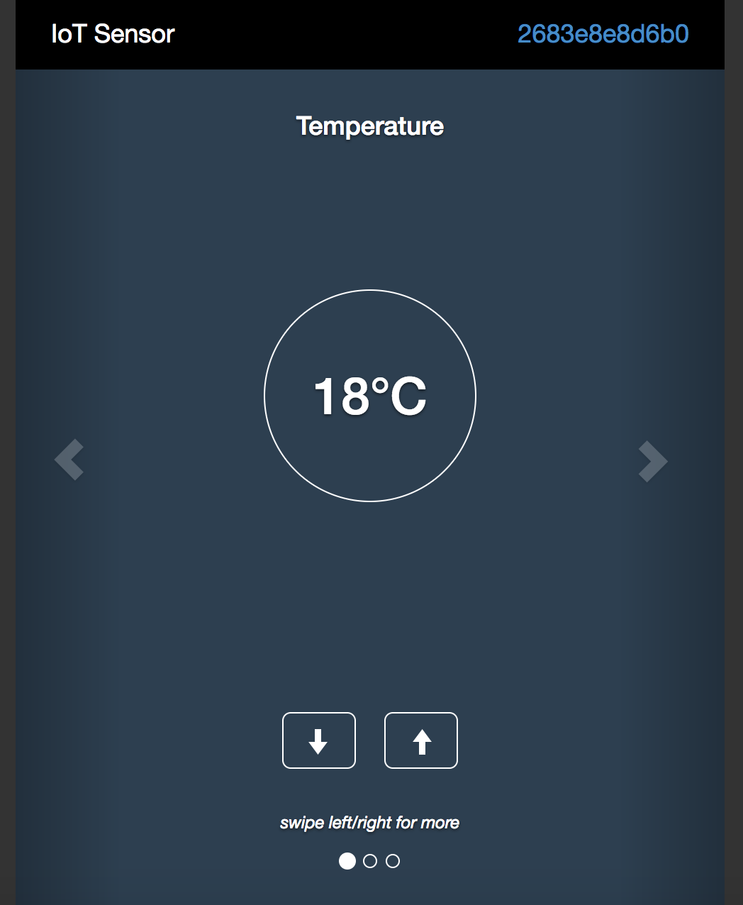
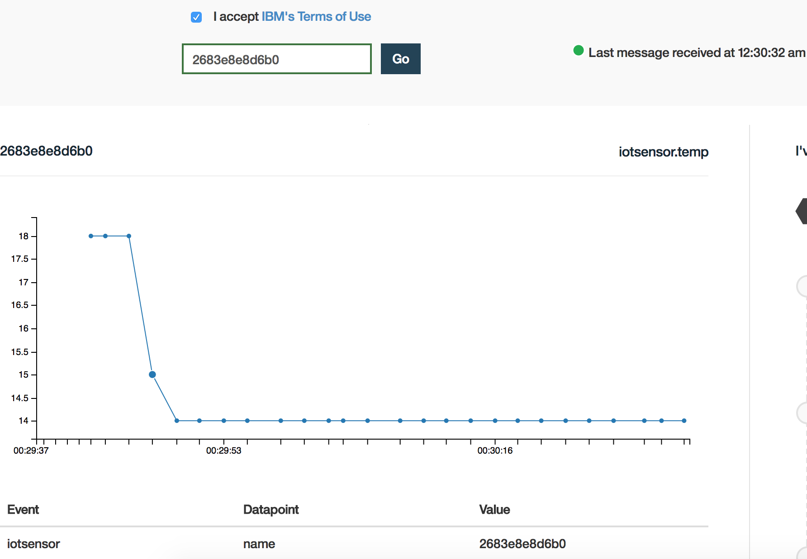

# Simulator #  
This section shows how you can use the Simulator to show multiple data-points on Quickstart dashboard.  

1. Open the [simulator link]( https://quickstart.internetofthings.ibmcloud.com/iotsensor/)

2. Top right side provides the device id as shown in the diagram below.

3. This simulator has 3 data points - temperature, Humidity and Object Temperature.

4. All these parameters can be either increased or decreased, by

5. Click top right of simulator to see the parameters in a dashboard.

6. You can keep on toggling between the simulator and the dashboard.
